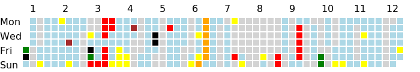

# location-grass

Location history in GitHub grass style.

## Requirements

- Python 3.6+
  - For formatted string literal ([2. 字句解析 — Python 3.7.4 ドキュメント](https://docs.python.org/ja/3/reference/lexical_analysis.html#formatted-string-literals))

## Example

||Legend|
|:-:|:-:|
|2014  2015  2016  2017  2018  2019 ||
